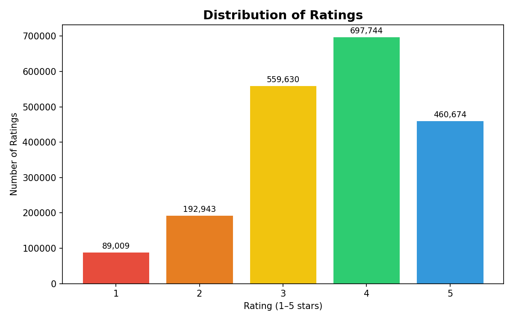
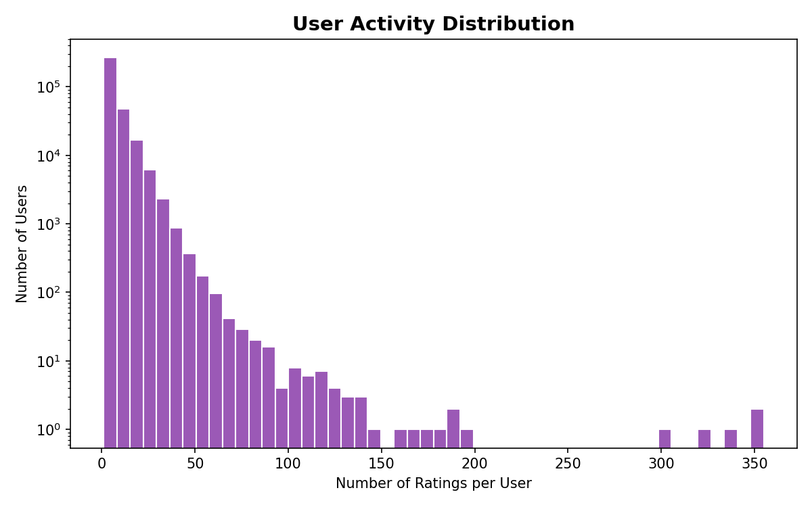
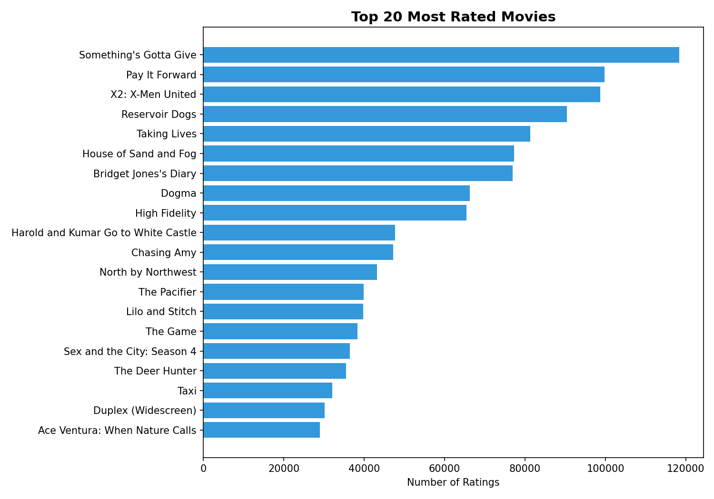
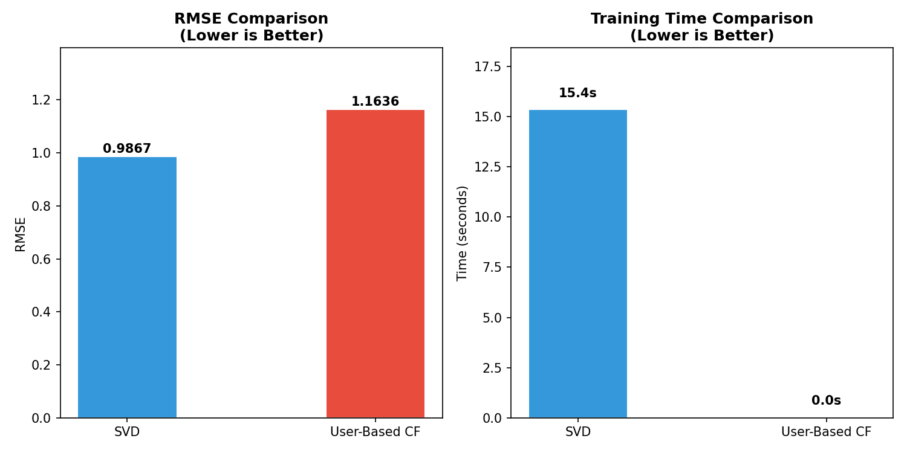

# Netflix Recommendation System

A movie recommendation system built using the Netflix Prize Dataset. The project compares collaborative filtering and matrix factorization techniques to generate personalized movie recommendations.

## Dataset
- Source: Netflix Prize Dataset
- Ratings Used: 2 Million+
- Rating Scale: 1–5
- Users: Thousands of unique users
- Movies: Thousands of unique movies

## Project Objectives
- Analyze user rating behavior
- Study content popularity trends
- Build recommendation models
- Compare recommendation performance
- Generate Top-K personalized recommendations

## Exploratory Data Analysis

### Rating Distribution


### User Activity Distribution


### Top Rated Movies


## Models Implemented

### 1. Item-Based Collaborative Filtering
- KNNBasic from Scikit-Surprise
- Similarity-based recommendations

### 2. Singular Value Decomposition (SVD)
- Matrix Factorization approach
- Learns latent user and movie preferences

## Model Comparison



| Model | RMSE |
|---------|---------|
| Item-Based CF | 1.1636 |
| SVD | 0.9867 |

## Results
- SVD achieved the best prediction accuracy.
- Dataset sparsity was above 99%.
- Personalized Top-10 movie recommendations were generated for users.
- Collaborative filtering performed well for active users and popular content.

## Repository Structure

```
netflix-recommendation-system/
│
├── netflix_eda.ipynb
├── netflix_model.ipynb
├── rating_distribution.png
├── user_activity.png
├── top_movies.png
├── model_comparison.png
├── top10_recommendations.csv
└── README.md
```

## Technologies Used
- Python
- Pandas
- NumPy
- Matplotlib
- Seaborn
- Scikit-Surprise

## Future Improvements
- Hybrid Recommendation System
- Neural Collaborative Filtering
- Streamlit Dashboard
- Real-Time Recommendation API
